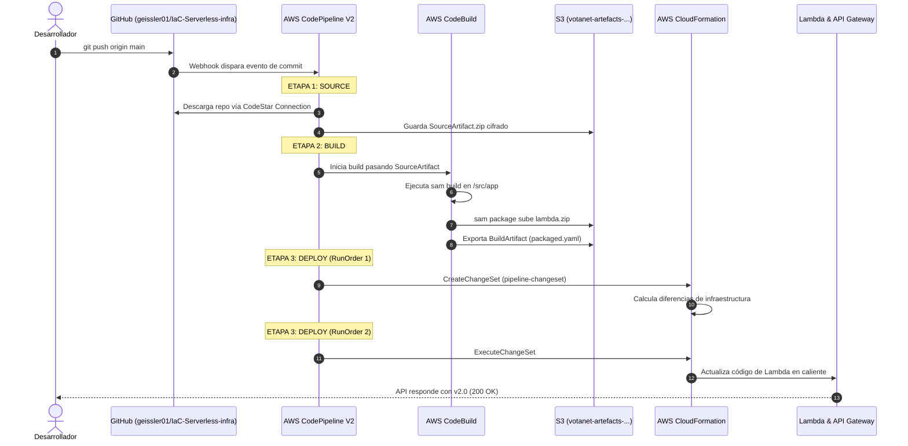

# Bitácora Técnica de Ingeniería: Proyecto VotaNet Serverless & CI/CD

> **Propósito del documento:** Esta es la guía técnica profunda e interna del proyecto. Aquí se detallan los principios de diseño, la física y arquitectura interna de AWS (sistemas de archivos, memoria, parsers), los errores superados durante la construcción y las decisiones de ingeniería tomadas en cada fase.

---

## Índice General

1. [Visión General de la Arquitectura](#1-visión-general-de-la-arquitectura)
2. [Física de AWS Lambda: Cómo funciona el Servidor por Dentro](#2-física-de-aws-lambda-cómo-funciona-el-servidor-por-dentro)
3. [El Ecosistema IAM: Anatomía y Filosofía de Permisos](#3-el-ecosistema-iam-anatomía-y-filosofía-de-permisos)
4. [La Guerra de los Parsers: Go (CodeBuild) vs PyYAML (CloudFormation)](#4-la-guerra-de-los-parsers-go-codebuild-vs-pyyaml-cloudformation)
5. [El Ciclo de Vida de CI/CD: De Git Push a Producción](#5-el-ciclo-de-vida-de-cicd-de-git-push-a-producción)
6. [Catálogo de Errores Críticos Resueltos en Vivo](#6-catálogo-de-errores-críticos-resueltos-en-vivo)
7. [Navegación Modular por Carpetas](#7-navegación-modular-por-carpetas)

---

## 1. Visión General de la Arquitectura

El proyecto moderniza una arquitectura serverless tradicional de hace 7 años (Platzi 2017) hacia los estándares cloud-native actuales (2024-2026):
* **Reemplazo de CodeCommit y Cloud9** (deprecados por AWS) por **GitHub + AWS CodeConnections + VS Code local**.
* **Reemplazo de Python 3.7** (deprecado) por **Python 3.12 con tipado estricto** (`@dataclass` nativo).
* **Infraestructura declarativa modular** desacoplada mediante `Outputs` y `!ImportValue`.
* **CI/CD desatendido** orquestado por CodePipeline V2.

```
[ Desarrollador ] ──git push──▶ [ GitHub Repository ]
                                        │
                                        ▼ (Webhook automático / CodeStar Connection)
                             [ AWS CodePipeline V2 ]
                                        │
            ┌───────────────────────────┴───────────────────────────┐
            ▼                                                       ▼
  [ AWS CodeBuild ]                                       [ AWS CloudFormation ]
  - Contenedor Amazon Linux 2023                          - Deploy Action (ChangeSet)
  - Ejecuta: sam build                                    - Asume CloudFormationDeployRole
  - Ejecuta: sam package                                  - Actualiza Lambda & API Gateway
  - Sube zip a S3 Artefactos
            │                                                       │
            ▼                                                       ▼
[ S3: votanet-artefacts-... ]                             [ Stack: votanet-dev-app-stack ]
                                                                    │
                                                 ┌──────────────────┴──────────────────┐
                                                 ▼                                     ▼
                                       [ Amazon API Gateway ]                [ AWS Lambda (Python 3.12) ]
                                       - CORS habilitado (OPTIONS)            - Lee y escribe
                                       - Rutas: /voters, /voters/{id}                  │
                                                                                       ▼
                                                                             [ Amazon DynamoDB ]
                                                                             - votanet-dev-voters (On-Demand)
```

---

## 2. Física de AWS Lambda: Cómo funciona el Servidor por Dentro

Muchos desarrolladores asumen erróneamente que una Lambda es "código flotando en la nube". En realidad, AWS Lambda se ejecuta sobre servidores físicos gestionados mediante **Firecracker MicroVMs**.

### El Sistema de Archivos Linux (`/`) dentro de la Lambda

Cuando se produce una invocación, AWS descomprime el paquete `.zip` en un contenedor con Amazon Linux:

```text
/ (Raíz del Sistema Operativo Linux)
├── bin/
├── usr/
├── etc/
│
├── var/
│   ├── runtime/       [MOTOR AWS]: Contiene bootstrap, boto3, botocore preinstalados. Solo lectura.
│   │
│   └── task/          [TU CODIGO]: Aqui se descomprime fisicamente lambda_function.py.
│                         ES DE SOLO LECTURA (Read-Only). No puedes crear archivos aqui.
│
├── opt/               [LAYERS]: Si usas capas Lambda, se montan aqui. Solo lectura.
│
└── tmp/               [DISCO ESCRIBIBLE]: Espacio efimero (512 MB a 10 GB).
                          Aqui es donde se deben guardar PDFs, CSVs o archivos temporales.
```

### Cold Start vs Warm Start (Memoria RAM)

1. **Cold Start (Inicio en Frío):**
   * Llega la primera petición. Firecracker arranca la microVM (~5 ms).
   * Se descargan los artefactos de S3 y se montan en `/var/task/`.
   * Se evalúa todo el código fuera de `def lambda_handler`:
     ```python
     # Esto se ejecuta UNA SOLA VEZ en el Cold Start:
     logger = logging.getLogger()
     dynamodb = boto3.resource('dynamodb')
     table = dynamodb.Table(TABLE_NAME)
     ```
   * La conexión a DynamoDB y las variables quedan vivas en la memoria RAM del proceso Python.

2. **Warm Start (Reutilización en Caliente):**
   * Peticiones subsiguientes en los siguientes 5-15 minutos **no vuelven a leer el disco ni a reimportar librerías**.
   * AWS simplemente ejecuta `lambda_handler(event, context)` directamente sobre el proceso que ya estaba esperando en RAM.
   * La latencia pasa de ~400 ms a **< 15 ms**.

### El Secreto de la CPU en Lambda
En AWS Lambda **no puedes elegir la potencia de la CPU por separado**. La CPU escala proporcionalmente a la memoria RAM asignada:
* `128 MB` de RAM asigna aproximadamente **0.08 vCPU**.
* `1,769 MB` de RAM asigna exactamente **1 vCPU completa**.

---

## 3. El Ecosistema IAM: Anatomía y Filosofía de Permisos

IAM (Identity and Access Management) es el cerebro de seguridad de AWS. En este proyecto se implementaron los siguientes conceptos avanzados:

### Trust Policy vs Permission Policy

| Concepto | ¿Qué pregunta responde? | ¿Dónde se declara? | Estructura Clave |
| :--- | :--- | :--- | :--- |
| **Trust Policy (Política de Confianza)** | **¿QUIÉN** puede ponerse este rol (sombrero)? | `AssumeRolePolicyDocument` | `Effect`, `Principal: Service: ...`, `Action: sts:AssumeRole`. **No lleva `Resource`**. |
| **Permission Policy (Política de Permisos)** | **¿QUÉ PUERTAS** puede abrir quien tenga el sombrero? | `Policies` o `ManagedPolicyArns` | `Effect`, `Action: [dynamodb:GetItem, ...]`, `Resource: arn:aws:...` |

### Capabilities: `CAPABILITY_IAM` vs `CAPABILITY_NAMED_IAM`
AWS exige consentimiento explícito antes de alterar la seguridad de la cuenta:
* **`CAPABILITY_IAM`:** Obligatoria cuando CloudFormation crea roles con nombres aleatorios automáticos (`[Stack]-[Id]-[Hash]`).
* **`CAPABILITY_NAMED_IAM`:** Obligatoria si en el YAML especificas `RoleName:` o `ManagedPolicyName:` con un nombre fijo (ej: `votanet-dev-lambda-execution-role`). Esto evita colisiones de nombres accidentales y elevaciones de privilegios descontroladas.

### El Truco de `!Select` y `!Split` para Nombres de Roles
En CloudFormation, el recurso `AWS::IAM::Policy` en su propiedad `Roles:` espera el **nombre simple del rol**, NO su ARN.
Para extraerlo de un ARN importado sin quemar el texto a mano:
```yaml
Roles:
  - !Select [1, !Split ["role/", !ImportValue CodePipelineRoleArn]]
```
* Texto original: `arn:aws:iam::841702867308:role/votanet-dev-prereq-stack-CodePipelineRole-kytXr6hYljJc`
* `!Split ["role/", ...]` divide el texto en `[0]` (prefijo) y `[1]` (nombre del rol).
* `!Select [1, ...]` extrae limpiamente el nombre sin importar la cuenta ni la región.

---

## 4. La Guerra de los Parsers: Go (CodeBuild) vs PyYAML (CloudFormation)

Durante el proyecto descubrimos en vivo por qué `buildspec.yml` fallaba mientras que los otros templates de CloudFormation funcionaban perfecto con comentarios:

### CloudFormation (Motor en C/PyYAML)
CloudFormation utiliza un analizador de YAML permisivo. Cuando encuentra el carácter `#`, descarta todo lo que esté a su derecha antes de evaluar los tokens de sintaxis. Por eso los comentarios inline (`clave: # comentario`) funcionan sin problemas.

### AWS CodeBuild Agent (Motor en Go - `go-yaml`)
El agente de CodeBuild está compilado en **Go (Golang)**. El deserializador estricto de Go para campos tipo slice (`[]string` como `commands:`) tiene un comportamiento particular:
1. Si escribes: `commands: # comentario`, el parser interpreta que la clave terminó en blanco y que el comentario rompe el flujo.
2. Si dentro del comando escribes: `- echo "=== Fase 1: verificando ==="`, el parser detecta los dos puntos seguidos de un espacio (`: `) y cree que `echo "=== Fase 1` es una **clave de diccionario** y `verificando...` es un **valor**, lanzando:
   `YAML_FILE_ERROR: Expected Commands[0] to be of string type: found subkeys instead at line 12`.
3. **Solución definitiva:** Usar flechas o guiones en los mensajes (`echo "Fase 1 -> ..."`), y colocar siempre los comentarios en su propia línea superior.

---

## 5. El Ciclo de Vida de CI/CD: De Git Push a Producción

El flujo de trabajo automatizado se compone de 3 etapas secuenciales:



### Persistencia del Directorio de Trabajo en CodeBuild
En CodeBuild, la sesión de bash entre fases (`build` y `post_build`) **mantiene el estado del directorio**:
* Si en `build` ejecutas `cd app`, la terminal queda parada en `/src/app/`.
* Si en `post_build` vuelves a ejecutar `cd app`, fallará con `No such file or directory` porque intentará buscar `/src/app/app/`.

---

## 6. Catálogo de Errores Críticos Resueltos en Vivo

| Error Observado en Terminal | Causa Raíz Técnica | Solución Aplicada |
| :--- | :--- | :--- |
| `expected minimum item count: 2, found: 1` | El linter de VS Code detectó sangría incompleta antes de guardar `Properties:` en la Lambda. | Indentación de 2 espacios bajo `Properties:` y verificación con `sam validate`. |
| `Requires capabilities : [CAPABILITY_NAMED_IAM]` | `template.yml` usó un nombre propio fijo (`RoleName: votanet-dev-lambda-execution-role`). | Agregar `capabilities = "CAPABILITY_IAM CAPABILITY_NAMED_IAM"` en `samconfig.toml`. |
| `Invalid service prefix for action 'sts.AssumeRole'` | Error tipográfico: se usó un punto (`sts.AssumeRole`) en lugar de dos puntos (`sts:AssumeRole`). | Corregir la sintaxis legal de IAM a `sts:AssumeRole`. |
| `Stack cannot be updated while in status ROLLBACK_COMPLETE` | CloudFormation no permite actualizar un stack que falló en su primerísimo intento de creación. | Limpiar el cascarón con `aws cloudformation delete-stack --stack-name votanet-dev-app-stack`. |
| `'Arn' is not one of ['ConnectionArn', ...] in us-east-1` | El recurso `AWS::CodeStarConnections::Connection` no tiene atributo `.Arn`, su atributo es `.ConnectionArn`. | Actualizar las referencias `!GetAtt` a `.ConnectionArn`. |
| `Expected Commands[0] to be of string type: found subkeys instead` | Un `echo "=== Fase 1: ..."` contenía `: ` sin estar completamente entrecomillado, engañando al parser de Go. | Reemplazar los dos puntos por flechas `->` en `buildspec.yml`. |
| `cd: app: No such file or directory` en `post_build` | La sesión de CodeBuild retuvo el `cd app` ejecutado en la fase `build` previa. | Eliminar el `cd app` redundante de la fase `post_build`. |

---

## 7. Navegación Modular por Carpetas

Para consultar las especificaciones exactas de cada componente, visita sus guías dedicadas:

* **Base de Datos:** [dynamo/README.md](dynamo/README.md)
* **Seguridad y Storage CI/CD:** [prereq/README.md](prereq/README.md)
* **Backend Serverless (SAM + Python):** [app/README.md](app/README.md)
* **Receta de Compilación CodeBuild:** [config/README.md](config/README.md)
* **Orquestador CodePipeline V2:** [pipeline/README.md](pipeline/README.md)
* **Guía Pública para Portafolio:** [README.md](README.md)

